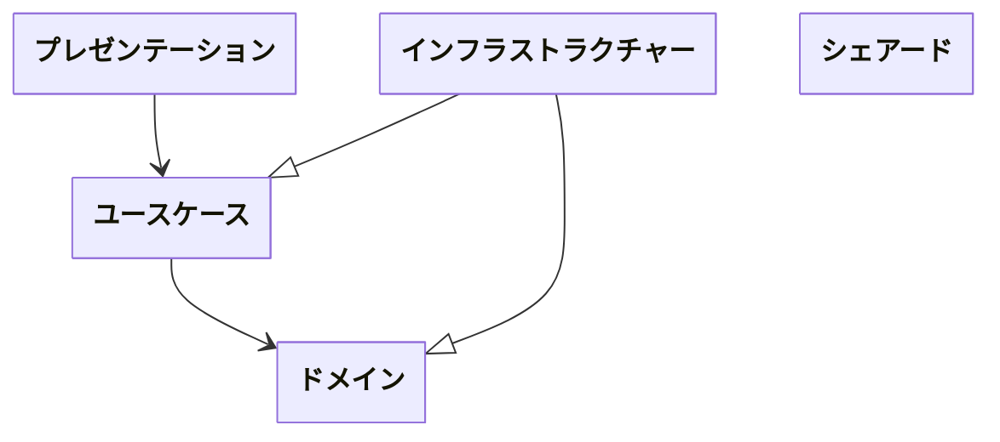
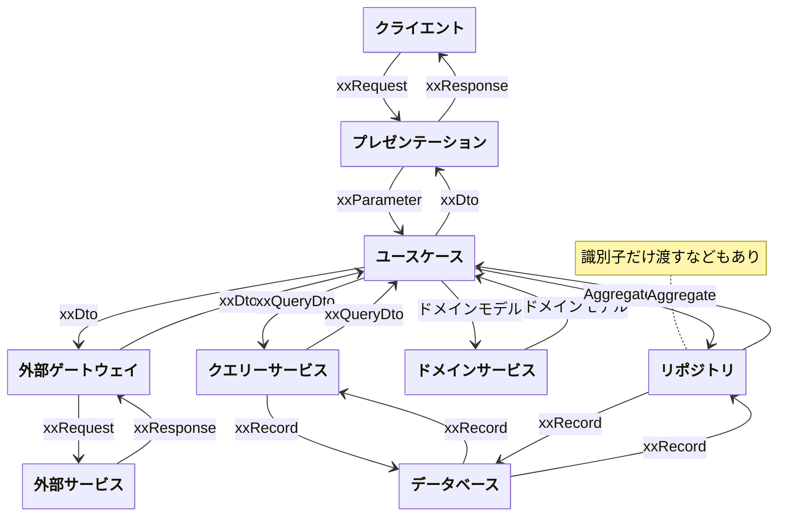
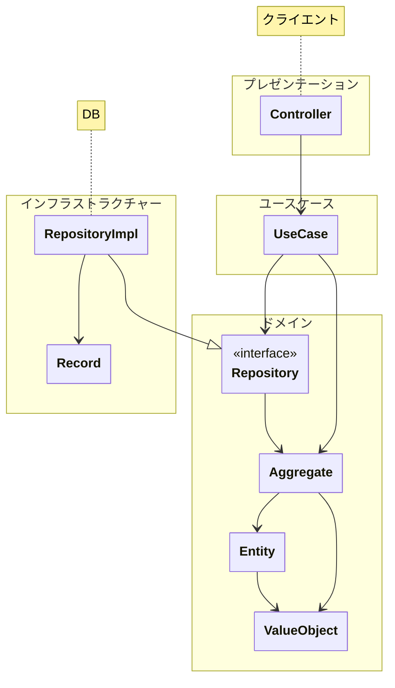
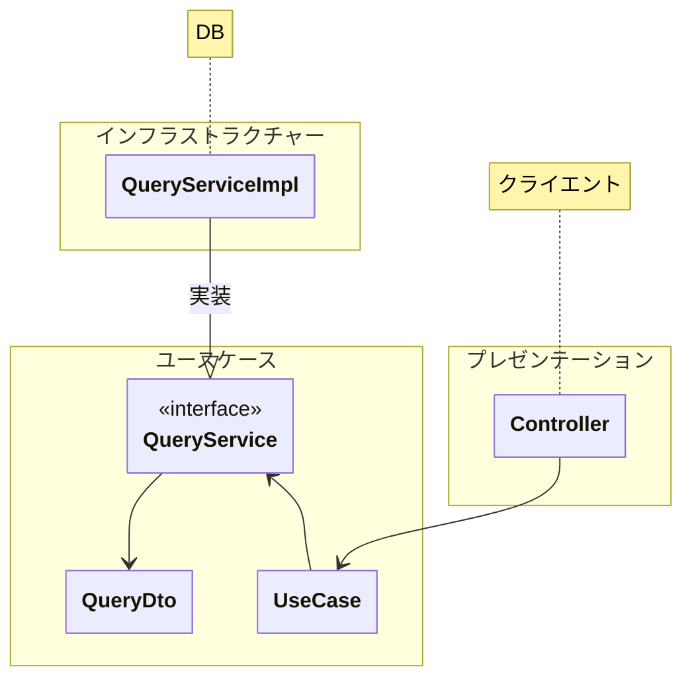
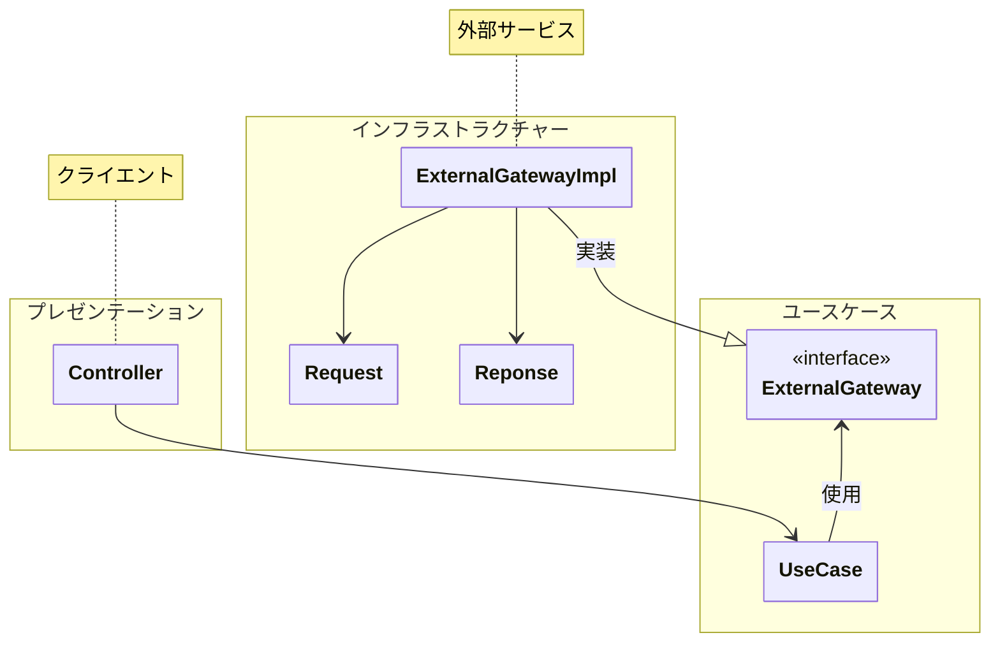

## レイヤー

- ユースケース層は「手順」
- プレゼンテーション層は「入出力」
- インフラストラクチャー層は「技術」
- ドメイン層は「業務として正しさ」
- シェアードはその他

```mermaid
---
  config:
    class:
      hideEmptyMembersBox: true
---
classDiagram

class presentation["プレゼンテーション"]
class infrastructure["インフラストラクチャー"]
class useCase["ユースケース"]
class domain["ドメイン"]
class shared["シェアード"]

presentation --> useCase
infrastructure --|> useCase
infrastructure --|> domain

useCase --> domain
```

---

## データ受け渡し

※ あくまで原則的なルールであり、適切ではない場合は変更する

```mermaid
---
  config:
    class:
      hideEmptyMembersBox: true
---
classDiagram

class client["クライエント"]
class presentation["プレゼンテーション"]
class repository["リポジトリ"]
class useCase["ユースケース"]
class queryService["クエリーサービス"]
class domainService["ドメインサービス"]
class externalGateway["外部ゲートウェイ"]
class externalService["外部サービス"]
class db["データベース"]

client --> presentation: xxRequest
client <-- presentation: xxResponse

presentation --> useCase: xxParameter
presentation <-- useCase: xxDto

useCase --> domainService: ドメインモデル
useCase <-- domainService: ドメインモデル

useCase --> externalGateway: xxDto
useCase <-- externalGateway: xxDto

externalGateway --> externalService: xxRequest
externalGateway <-- externalService: xxResponse

note for repository "識別子だけ渡すなどもあり"
useCase --> repository: Aggregate
useCase <-- repository: Aggregate

useCase --> queryService: xxQueryDto
useCase <-- queryService: xxQueryDto

queryService --> db: xxRecord
queryService <-- db: xxRecord

repository --> db: xxRecord
repository <-- db: xxRecord

```

---

## 更新系

```mermaid
---
  config:
    class:
      hideEmptyMembersBox: true
---
classDiagram

namespace プレゼンテーション {
  class Controller
}

namespace インフラストラクチャー {
    class RepositoryImpl
    class Record
}

namespace ユースケース {
    class UseCase
}

namespace ドメイン {
    class Repository {
      <<interface>>
    }
    class Aggregate
    class Entity
    class ValueObject
}

note for Controller "クライエント"
note for RepositoryImpl "DB "

Controller --> UseCase

UseCase --> Aggregate
UseCase --> Repository


RepositoryImpl --> Record
RepositoryImpl --|> Repository
Repository --> Aggregate

Aggregate --> Entity
Aggregate --> ValueObject
Entity --> ValueObject
```

---

## 参照系

```mermaid
---
  config:
    class:
      hideEmptyMembersBox: true
---
classDiagram

namespace プレゼンテーション {
  class Controller
}

namespace インフラストラクチャー {
    class QueryServiceImpl
}

namespace ユースケース {
    class QueryService {
      <<interface>>
    }
    class QueryDto
    class UseCase
}

note for Controller "クライエント"
note for QueryServiceImpl "DB "

Controller --> UseCase

QueryService <-- UseCase
QueryServiceImpl --|> QueryService: 実装
QueryService --> QueryDto


```

## 外部接続

```mermaid
---
  config:
    class:
      hideEmptyMembersBox: true
---
classDiagram


namespace プレゼンテーション {
  class Controller
}

namespace インフラストラクチャー {
    class ExternalGatewayImpl
    class Request
    class Reponse
}

namespace ユースケース {
    class ExternalGateway {
      <<interface>>
    }

    class UseCase
}

note for Controller "クライエント"
note for ExternalGatewayImpl "外部サービス"

Controller --> UseCase

ExternalGatewayImpl --|> ExternalGateway: 実装
ExternalGatewayImpl --> Request
ExternalGatewayImpl --> Reponse

ExternalGateway <-- UseCase: 使用

```

---
