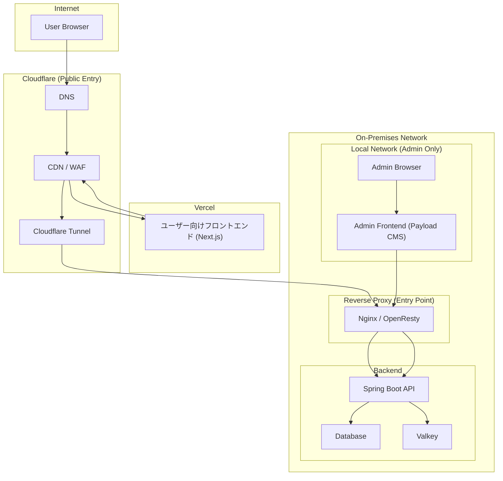

**目的**

- 構築担当や運用保守者向けのドキュメント
- インフラの構成を示す
- ネットワーク構成や流れを示す
- サーバー構成を示す

**注意**

- ソフトウェアの構成に引っ張られ内容に書く
- データの流れを意識して記載
- 安全性を担保する構成要素を省略しない

**Diagram**

```mermaid
flowchart TB
    %% Internet
    subgraph Internet["Internet"]
        UserBrowser["User Browser"]
    end

    %% Cloudflare
    subgraph Cloudflare["Cloudflare (Public Entry)"]
        DNS["DNS"]
        CDN["CDN / WAF"]
        Tunnel["Cloudflare Tunnel"]
    end

    %% Vercel
    subgraph Vercel["Vercel"]
        UserFrontend["ユーザー向けフロントエンド (Next.js)"]
    end

    %% On-Prem
    subgraph OnPrem["On-Premises Network"]

        %% Admin LAN
        subgraph AdminLAN["Local Network (Admin Only)"]
            AdminBrowser["Admin Browser"]
            AdminFrontend["Admin Frontend (Payload CMS)"]
        end

        %% Gateway
        subgraph Proxy["Reverse Proxy (Entry Point)"]
            ReverseProxy["Nginx / OpenResty"]
        end

        %% Backend
        subgraph Backend["Backend"]
            API["Spring Boot API"]
            DB["Database"]
            Valkey["Valkey"]
        end
    end

    %% User Flow (Public)
    UserBrowser --> DNS
    DNS --> CDN
    CDN --> UserFrontend

    %% User API Access (Tunnel)
    UserFrontend --> CDN
    CDN --> Tunnel
    Tunnel --> ReverseProxy
    ReverseProxy --> API

    %% Admin Flow (Local Only)
    AdminBrowser --> AdminFrontend
    AdminFrontend --> ReverseProxy
    ReverseProxy --> API

    %% Data
    API --> DB
    API --> Valkey

```
